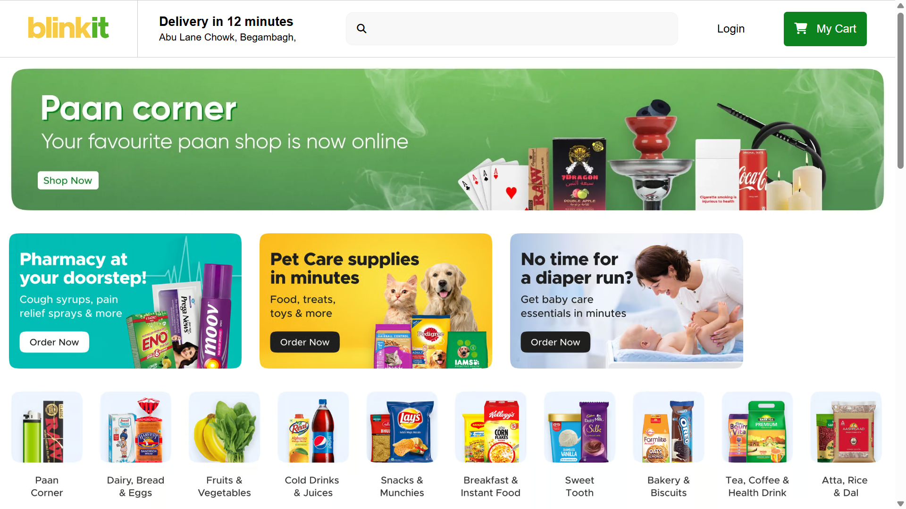
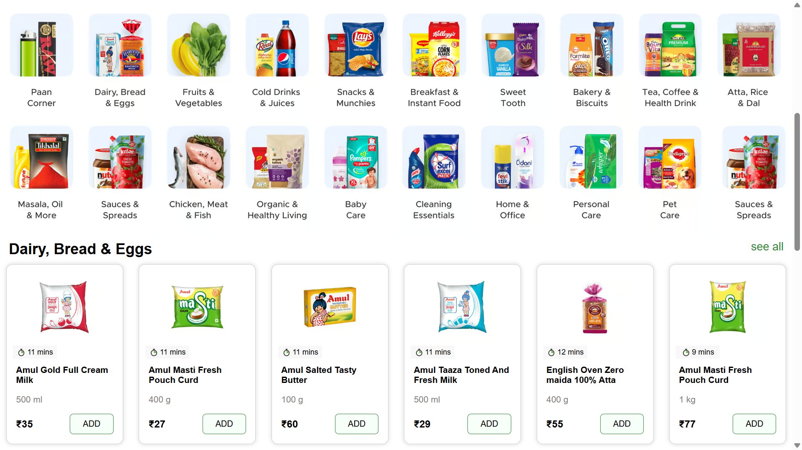
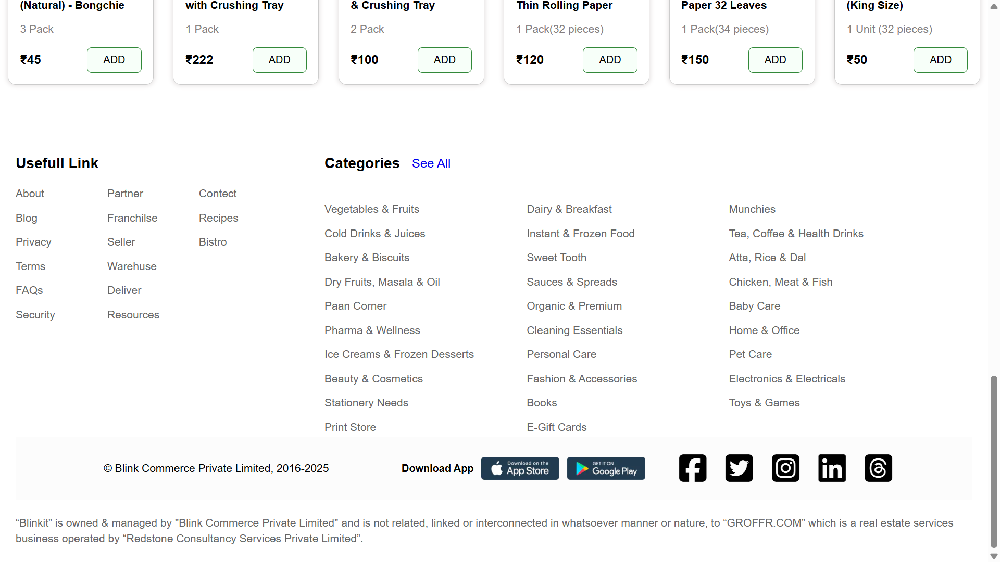

🛒 Blinkit E-commerce Clone  
This is a front-end clone of the Blinkit (formerly Grofers) e-commerce grocery website, built using **HTML**, **CSS**, and **JavaScript**.  
It replicates the look and feel of Blinkit’s UI, focusing on layout, responsiveness, and interactive design.

📁 Sections  
- **Home Page** – Attractive landing layout with search bar and navigation  
- **Product Categories** – Showcase of grocery and daily need items  
- **Offers Section** – Highlighting ongoing deals and discounts  
- **Cart UI** – Basic cart interface for item previews  
- **Footer** – Useful links, help section, and contact info  

🚀 Features  
- Fully responsive design  
- Hover effects and transitions for better UX  
- Sticky navigation bar  
- Product cards with quick-view buttons  
- Search bar styling with icons

🔧 Technologies Used  
- HTML5  
- CSS3  
- JavaScript (basic DOM interaction)  
- Font Awesome (for icons)  
- Google Fonts  

🌐 Live Demo  
👉 [Click here to view the live site](https://manish6862.github.io/blinkit-ecommerce-clone/ )

📷 Screenshots  
1. **Homepage View**  
   

2. **Product Section**  
   

3. **Footer Section**  
   
  

👤 Author  
**Manish Rajput**

📌 Note: This is a front-end clone for educational purposes and does not include backend or real-time functionality.
